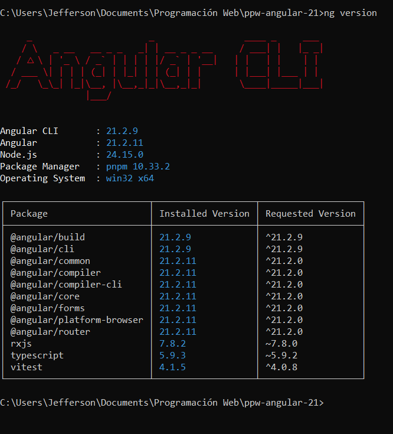
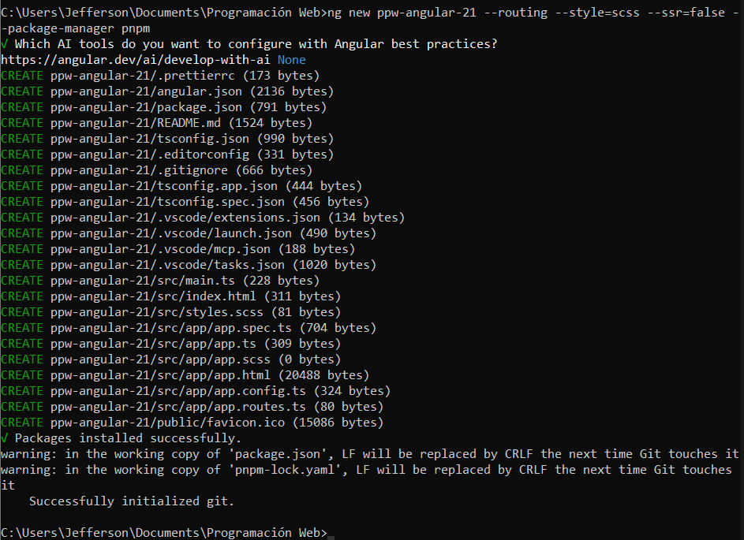
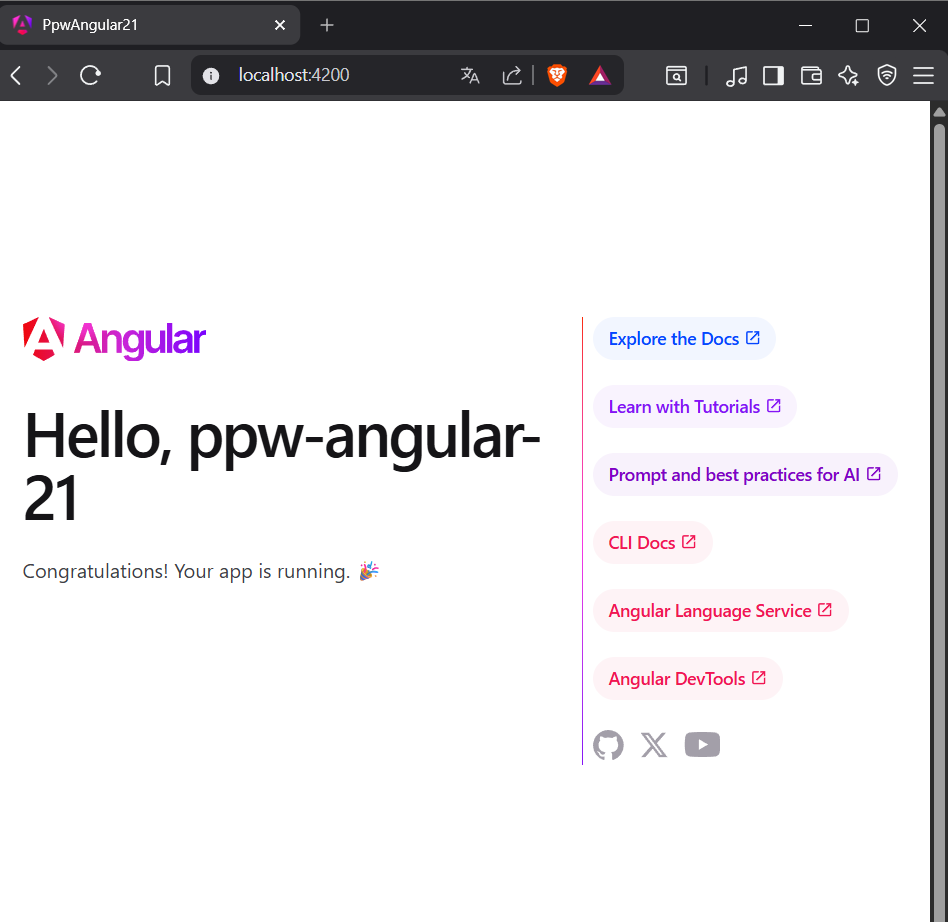
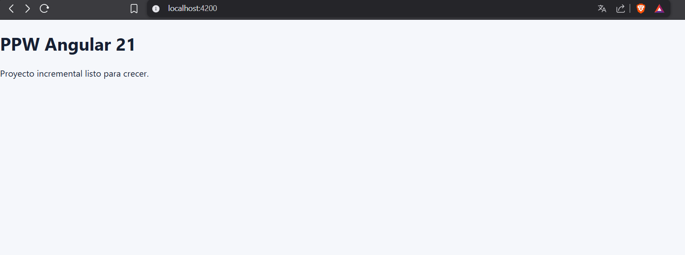

# Angular-21
El propósito de este proyecto es la de establecer una estructura inicial que sirve para el desarrollo incremental de proyectos a lo largo del semestre
### 1. Salida de ng version en la terminal

### 2. Proceso de creacion del proyecto con Angular CLI

### 3. Página de bienvenida de Angular antes de modificar

### 4. HomePage funcionando en localhost:4200

s